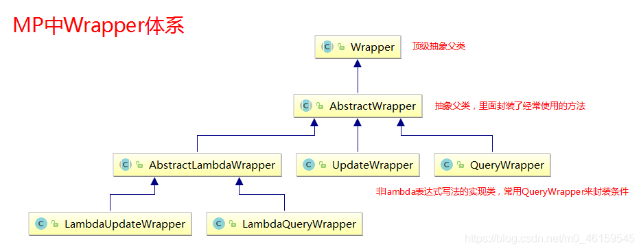

# Mybatis-Plus中的条件构造器
```java
<dependency>
    <groupId>com.baomidou</groupId>
    <artifactId>mybatis-plus-boot-starter</artifactId>
    <version>3.5.2</version>
</dependency>
```




如果要使用MP的查询、删除方法，通常使用**QueryWrapper**作为条件的封装实现类；因为它的功能比较强大。

```java
//1、ge、gt、le、lt、eq、ne、isNull、isNotNull
@Test
public void testDelete() {
    QueryWrapper<User> queryWrapper = new QueryWrapper<>();
    queryWrapper
        .isNull("name")
        .ge("age", 12)
        .isNotNull("email");
    int result = userMapper.delete(queryWrapper);
    System.out.println("delete return count = " + result);
}
//执行sql
UPDATE user SET deleted=1 
                        WHERE deleted=0 
                        AND 
                        name IS NULL 
                        AND
                        age >= ? 
                        AND 
                        email IS NOT NULL 
```

```java
//BETWEEN notBetween
@Test
public void testSelectCount() {
    QueryWrapper<User> queryWrapper = new QueryWrapper<>();
    queryWrapper.between("age", 20, 30);
    Integer count = userMapper.selectCount(queryWrapper);
    System.out.println(count);
}
//执行sql
//SELECT COUNT(1) FROM user WHERE deleted=0 AND age BETWEEN ? AND ?  
```

```java
//likeRight  notLike
@Test
public void testSelectMaps() {
	QueryWrapper<User> queryWrapper = new QueryWrapper<>();
	queryWrapper
    	.notLike("name", "e")
        //t开头
    	.likeRight("email", "t");
    //返回值是Map列表
	List<Map<String, Object>> maps = userMapper.selectMaps(queryWrapper);
	maps.forEach(System.out::println);
}
```

```java
//orderBy、orderByDesc、orderByAsc
@Test
public void testSelectListOrderBy() {
    QueryWrapper<User> queryWrapper = new QueryWrapper<>();
    queryWrapper.orderByDesc("id");//根据id降序
    List<User> users = userMapper.selectList(queryWrapper);
    users.forEach(System.out::println);
}
```

```java
//查询指定的字段，select
@Test
public void testSelectListColumn() {
    QueryWrapper<User> queryWrapper = new QueryWrapper<>();
    queryWrapper.select("id", "name", "age");//仅查询id", "name", "age"字段
    List<User> users = userMapper.selectList(queryWrapper);
    users.forEach(System.out::println);
}
//执行sql
SELECT
        id,
        name,
        age 
    FROM
        user 
    WHERE
        deleted=0
```

要使用MP的修改方法，通常使用**UpdateWrapper**作为条件的封装实现类，因为它提供了一些独有的方法，适用于update操作，比如set和setSql方法；

```java
//or、and
@Test
public void testUpdate1() {
    //修改值
    User user = new User();
    user.setAge(99);
    user.setName("Andy");
    //修改条件
    UpdateWrapper<User> userUpdateWrapper = new UpdateWrapper<>();
    userUpdateWrapper
        .like("name", "h")
        .or()
        .between("age", 20, 30);
    int result = userMapper.update(user, userUpdateWrapper);
    System.out.println(result);
}
```

```java
@Test
public void testUpdateSet() {
    //修改值，仅修改age字段
    User user = new User();
    user.setAge(99);
    //修改条件
    UpdateWrapper<User> userUpdateWrapper = new UpdateWrapper<>();
    userUpdateWrapper
        .like("name", "h")
        .set("name", "老李头")//使用set增加修改的字段
        .setSql(" email = '123@qq.com'");//可以有子查询，因为这里设置的可以是一个sql语句，也可以是一个片段。要注意最前面的空格
    int result = userMapper.update(user, userUpdateWrapper);
}

//执行sql
UPDATE	user 
        SET
            age=99,
            name='老李头',
            email = '123@qq.com' 
        WHERE
            deleted=0 
            AND 
            name LIKE '%h%'
```


参考学习

[mp-一心](https://blog.csdn.net/Huang_ZX_259/article/details/122524602)

[mp条件构造器](https://blog.csdn.net/m0_46159545/article/details/107161814)